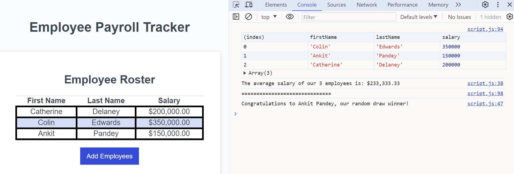

# Employee Payroll Tracker

## Description
This week's challenge required us to update the starter code to create an application that allows a payroll manager to see their employees payroll data.
## Screenshots

## User Story
AS A payroll manager
I WANT AN employee payroll tracker
SO THAT I can see my employees' payroll data and properly budget for the company
## Acceptance Criteris
GIVEN an employee payroll tracker
WHEN I click the "Add employee" button
THEN I am presented with a series of prompts asking for first name, last name, and salary
WHEN I finish adding an employee
THEN I am prompted to continue or cancel
WHEN I choose to continue
THEN I am prompted to add a new employee
WHEN I choose to cancel
THEN my employee data is displayed on the page sorted alphabetically by last name, and the console shows computed and aggregated data
## Links
Deployed Link: https://catdelaney.github.io/UoT-Module-3-Challenge-EMPLOYEE-PAYROLL-TRACKER/

GitHub Repo: https://github.com/catdelaney/UoT-Module-3-Challenge-EMPLOYEE-PAYROLL-TRACKER